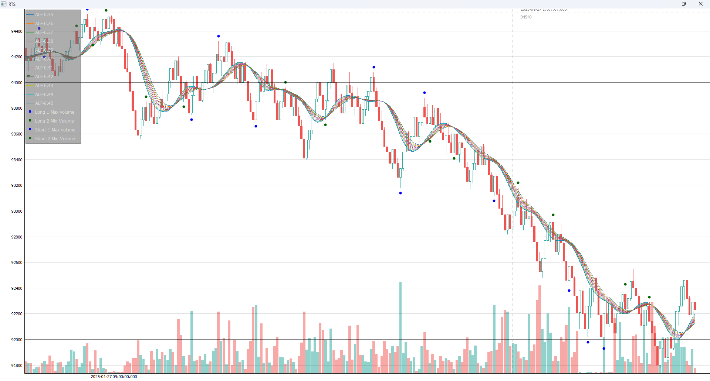
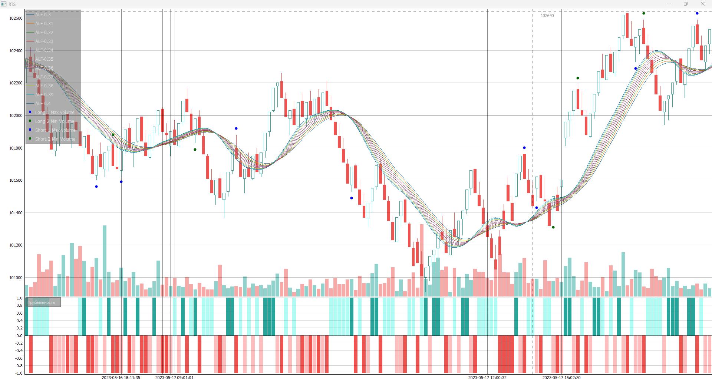

# Создание графиков.  
  
[result_profit_loss_bar.py](OLD/err_result_profit_loss_bar.py) - 
создание csv с признаком был ли бар профитным.  
Создание новых колонок: 
direction, takeprofit, stoploss, profitable.  
Открытие позиции по close текущего бара.  

[chart_range_db_all_ind.py](chart_range_db_all_ind.py)

[chart_range_csv_all_ind_profitable.py](chart_range_csv_all_ind_profitable.py)

